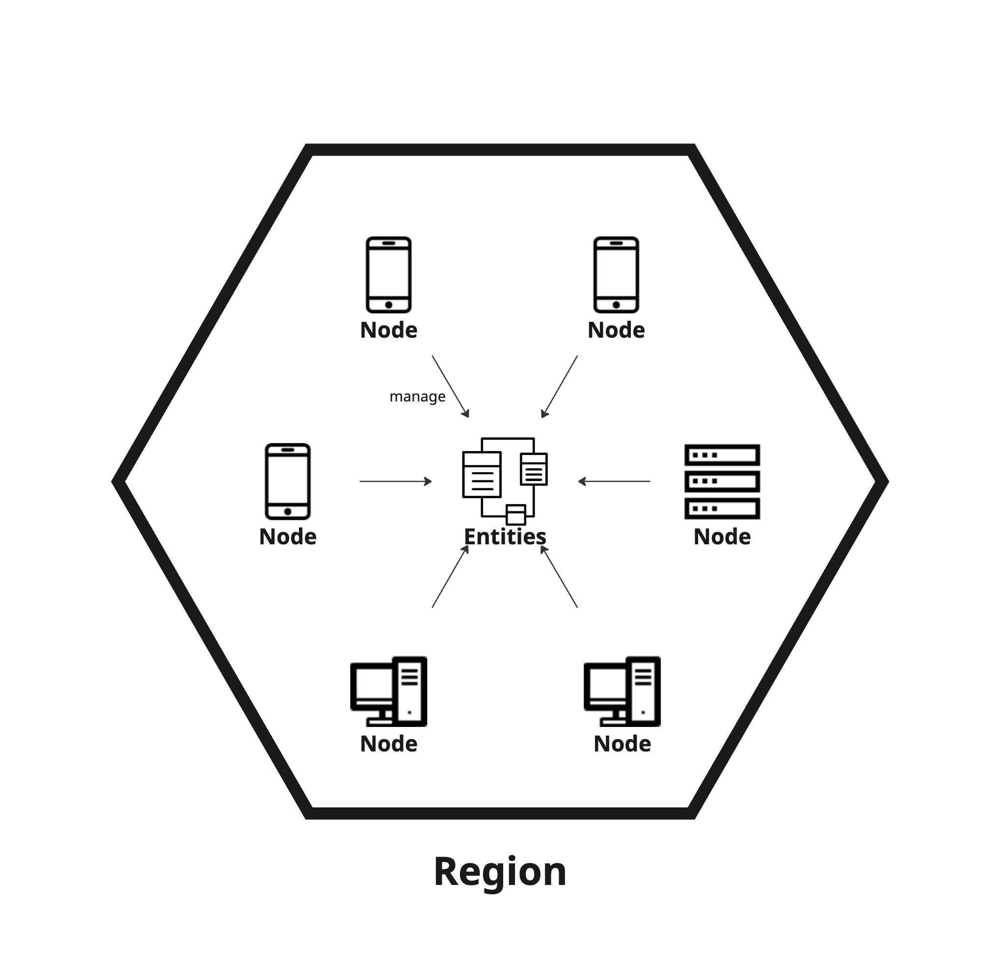

# 3.3.3 Region

<figure><figcaption>
Figure 3: Overview of region.
</figcaption></figure>

In ALMA, fundamental entities, such as schema, ID, storage, and node, are governed in a  **region**. Details are described in [3.7-region](../3.7-region/ "mention").
