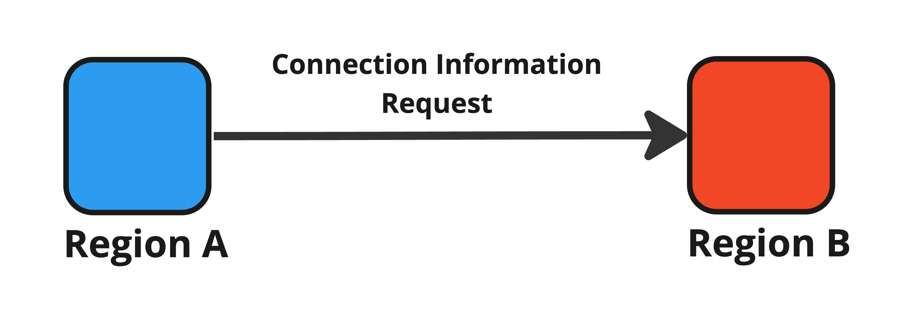

# Step 1: Connection Information Request

<figure><figcaption>
Figure 8: Connection information request.
</figcaption></figure>

First of all, the origin region A requests the target region B for the information as listed below:

* Acceptability: Whether the target region accepts connection from other regions.
* Region Information: General information such as the number of IDs and instances, etc.
* Connected Regions: A list of the regions connected to the target region.

The origin region A decides whether to connect by these information. It should be noted that it is risky to swallow the received information since the target region B may offer false information. Therefore it is recommend to collect materials from the multiple connected regions.

