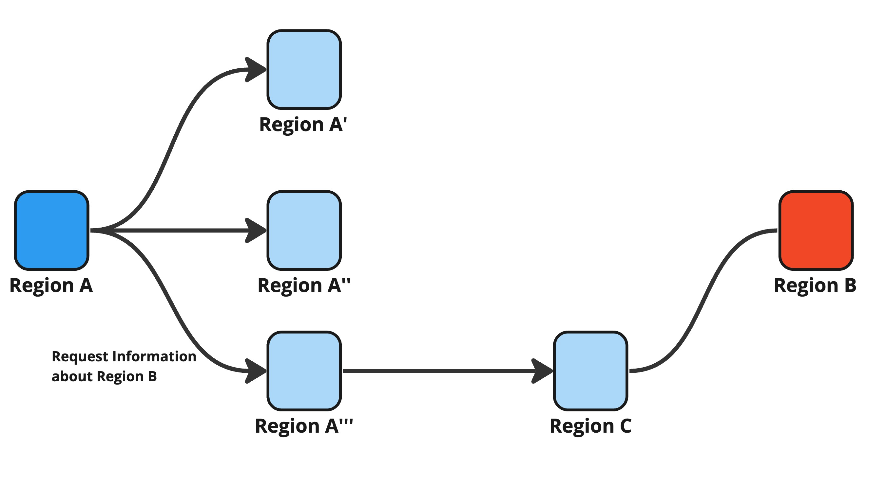
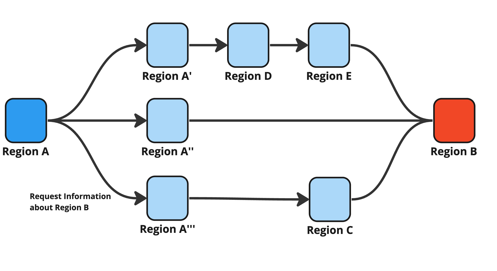

# Step 2: Request to Connected Region

<figure><figcaption>
Figure 9: The origin region (Region A) asks the connected regions (Region A', A'', A''') about the information of the target region (RegionB). The request may be passed between connected regions (from Region A''' to Region C).
</figcaption></figure>

<figure><figcaption>
Figure 10: If the target region (Region B) is connected to multiple regions, the origin region (Region A) collects the information of the target region from the multiple connected regions.
</figcaption></figure>

The origin region A asks to the regions connected to it (i.e., Region A', A'', A''' in Figure 9) whether they are connected to the target region B or they have any information about region B. If they are connected to region B, region A gets the information of B from them, and judges whether to request connection by comparing the information from the connected regions and one from region B.

If the target region B is connected to multiple regions (as shown in Figure 10), the origin region A judges by multiple point of view. Since it may take time if the number of redirecting, the request can be limited by Time-to-Live (TTL).
