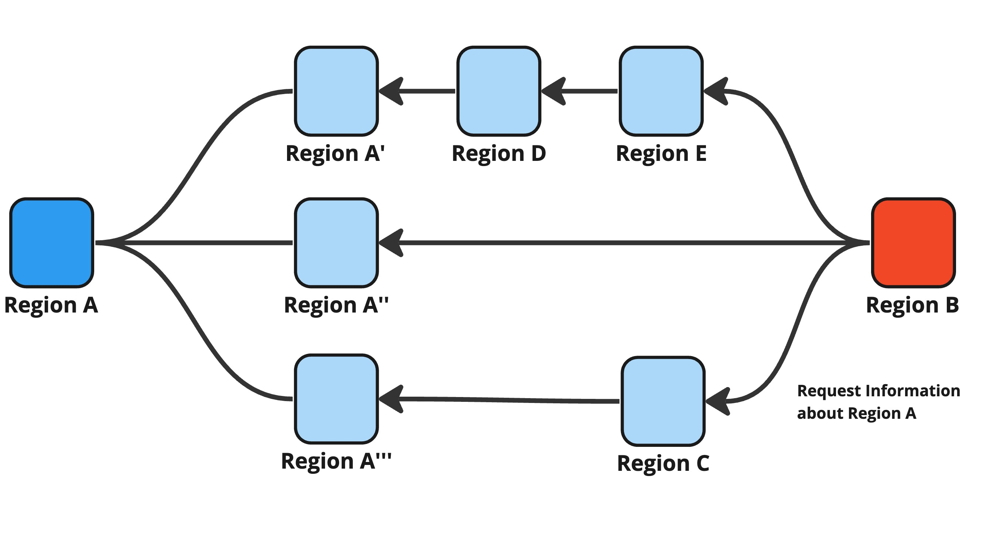

# Step 3: Counter Due Diligence

<figure><figcaption>
Figure 11: Counter due diligence.
</figcaption></figure>

After the target region B received [a connection information request of Step 1](step-1-connection-information-request.md), it query the connected regions about the information of the origin region A as shown in Figure 11.

