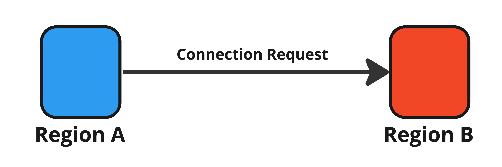

# Step 4: Connection Request

<figure><figcaption>
Figure 12: Connection Request.
</figcaption></figure>

If the source region (Region A) judges that there is no problem, it requires connection to the destination region (Region B), which then decides to accept or reject it automatically or manually.

When the connection is established, the following data are synchronized:

* Region ID
* Region Metadata
  * the number of users
  * the number of instances
* Connected Region List
* Connection Timestamp
* Synchronization Interval
