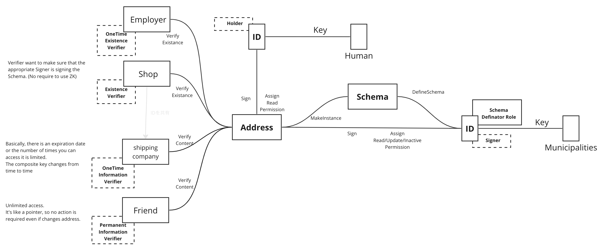

# 4.2 Address

<figure><figcaption>
Figure 13: Use case of address schema/instance.
</figcaption></figure>

This section describes a use case where (physical) address is managed and presented using ALMA. In case of address, flexibility in privacy settings (e.g., disclosing existence of the address and setting public range and expiration date) is important. The entity relation then designed as follows.

* **Definator**: An entity who defines a schema. This can be municipality, etc.
* **Signer**: An entity who guarantees the correctness of the address in the instance. This also can be municipality, etc.
* **Holder**: An entity who actually is associated with the address.
* **Existence Verifier**: An entity who checks if the address actually exists. This can be an employer or a shop, etc, since they want to know if the identity of the holder is clear, or if the address is available for delivery.
* **Information Verifier**: An entity who see the content of the address. Deadlines and number of views may be limited.
