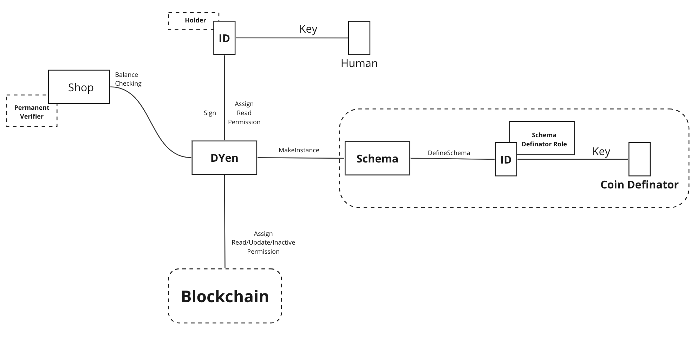

# 4.3 Fiat-Collateralized Stablecoin

For stablecoin, transaction history and balances must be maintained in some way. We propose a model combining blockchain. The characteristic of this architecture is that ALMA is used to store the balance and to manage the information of the associated ID, and the transactions are managed by blockchain.

<figure><figcaption>
Figure 14: Use case for stable coin.
</figcaption></figure>

**Registration**

Financial institutions, municipalities, and companies create their own coin schema inherited from an original coin schema and store them in a schema provider. An user with ID reads the schema and links it with the ID. The user conduct KYC for the ID using an address instance.

**Transaction**

The user transmits a transaction command to the blockchain and send money. When a transaction is made, data is synchronized from the blockchain to the node and the balance data is recorded in the node.
