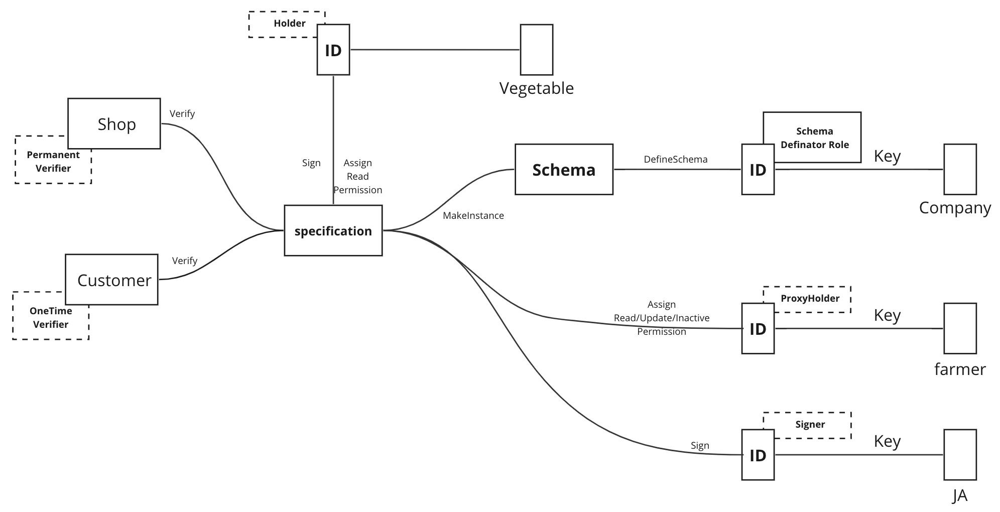

# 4.4 Objects

<figure><figcaption>
Figure 15: Use case for assigning ID to objects.
</figcaption></figure>

In ALMA, physical objects also can be assigned IDs. Since object itself cannot have will to interact with the system, the management authority is delegated to a person's ID.

Consider that a farmer assigns ID to a vegetable. A government public office defines a schema expressing information about a vegetable. Based on the schema, the farmer or the farmer's co-op issues an instance to the vegetable, and the farmer holds the instance. The farmer is a proxy holder with the management authority. Customers, shops or restaurants read the instance to get and verify the information of the vegetable.

* **Definator**: A governmental office.
* **Signer**: The farmer's co-op.
* **Holder**: The vegetable.
* **Proxy Holder**: The farmer.
* **Verifier**: Customers, shops or restaurants.
