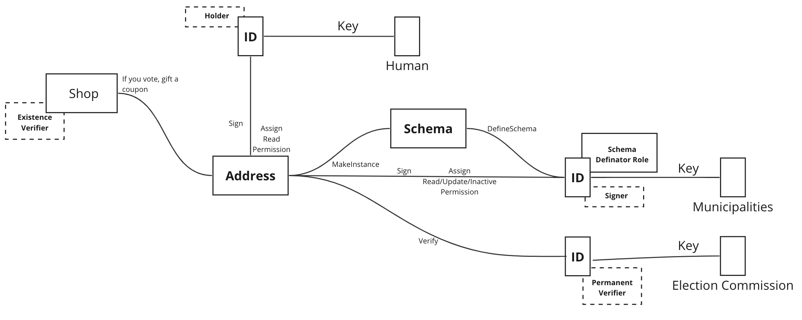

# 4.5 Electoral Voting

<figure><figcaption>
Figure 16: Use case for election.
</figcaption></figure>

When ALMA is used in an electoral voting, the contents of the instance can be disclosed only to a specific ID, and only the fact that the vote was cast can be disclosed to others. In Japan, declining voting rates are a social problem, and various efforts are being made to encourage people to vote. One such example is that voters can receive discounts and other services by presenting their voting receipt at certain stores after casting their ballot. By using ALMA, it is possible to present the fact that one has voted not only at a physical store but also on the Internet.

* **Definator**: An election administration committee.
* **Signer**: A voter.
* **Holder**: A voter.
* **Existence Verifier**: Shops to offer discount to a voter using the fact that vote was cast.
* **Information Verifier**: The election administration committee.
